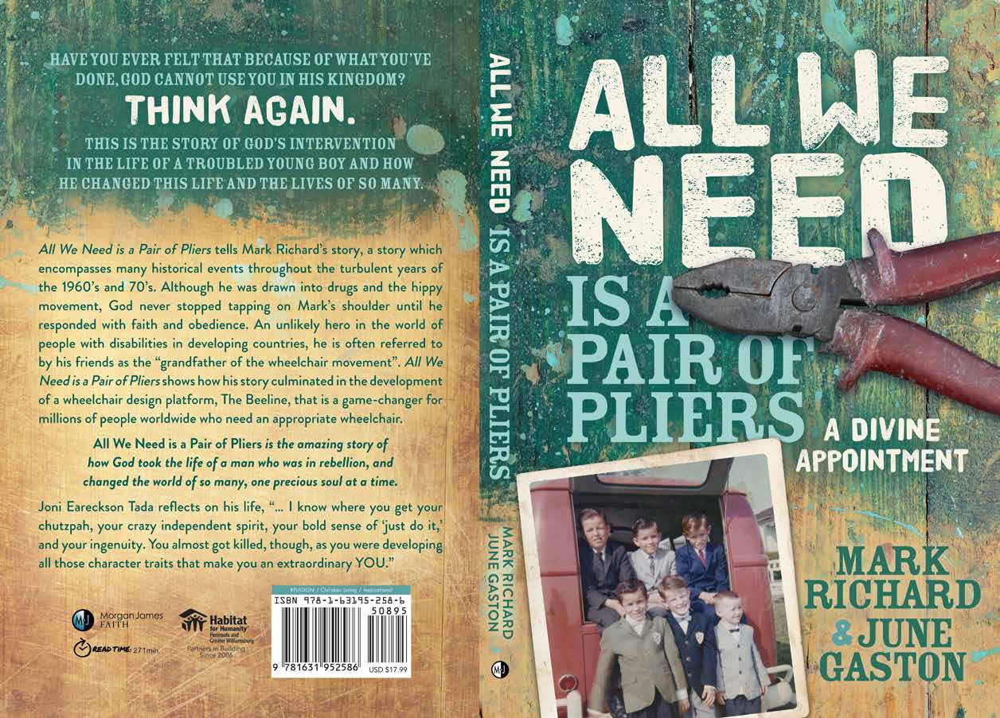

 

# All We Need Is A Pair Of Pliers
---
[
Click here to purchace on Amazon!](https://www.amazon.com/Mark-Richard/dp/1631952242)

---

Listen to a free sample of the audiobook:

audiobook.mp3

---

# Introduction

It seemed like a good idea at the time, but I had three days in the hospital to regret it. When I was fourteen, my younger brother David was getting into a lot of trouble. Mom’s working hours were long, and we had very little supervision. He had most recently broken into a gun club and stolen beer and gunpowder. The beer was an immediate reward, but the gunpowder provided opportunities for endless enjoyment. We went to a nearby construction site and “borrowed” a truck that we used to pick up the stolen goods that were hidden in some woods near the gun club. I had very little experience driving, with most of it behind the wheel of a tractor. This two and a half-ton truck with a stick shift was a challenge for me to drive, but my experience with the tractor helped a little. I hope that the truck still had a bit of its clutch left when we returned it. 
We needed to find a place to hide the gunpowder and knew of a dry, shallow well near the rural house we were renting in Prairie du Sac, Wisconsin. We carefully lowered it down into the well and breathed a sigh of relief when it was safely hidden. Our friends had provided dynamite fuses, and we entertained ourselves by making bombs using empty C02 cartridges. We would put wax around the fuses so they were waterproof, throw them off of the bridge going 
over the Wisconsin River, and watch the dead carp roll up to the surface. Our creativity led to the idea of developing a rocket out of a pole lamp. In retrospect, I’m pretty sure the pole lamp probably had enough gunpowder in it for about five hand grenades. To give us credit, we weren’t attempting to blow anyone up but just trying to make a rocket. I lit the lamp section, and my brother Kenny threw it. I thought he was going to throw it as high and far as he could. The top section had a spring in it, so instead of throwing it, he tried to bounce the spring-loaded section off the ground. The open end hit the ground, and by cutting off the oxygen, it exploded and threw me about seventy feet. I landed within twenty feet of our back door. Mom came running out, took in the scene, and with a scream of “Oh my God!” that I’ll never forget, she headed back into the house to call the police. I gazed down at the twenty or so pieces of shrapnel sticking out of my body from my feet to my chest, with larger cuts near my knees. Not wanting the police involved, I came up with a better suggestion and informed mom that “all we need is a pair of pliers.” There was, of course, a story behind this. 
Three years before, when we lived in Canoga Park, California, we were getting ready to load up our 1961 Volkswagen van to drive to Wisconsin. My mom was darning some socks in the living room, and she had a large darning needle sticking out of the carpet. David ran into the living room, dropped to his knees, and the needle went under his kneecap. Panic erupted, but my father came in and calmly said, “All we need is a pair of pliers.” He quickly retrieved the pliers from the garage and pulled out the needle. At some point during this current catastrophe, I had the presence of mind to come up with what I thought was a reasonable, proven solution. 
Mom still called the police, and I ended up with over eighty stitches and had to be hospitalized, but thankfully, I didn’t end up in jail. The police drove up with their brand new Pontiac station wagon. The policeman was more worried about me bloodying up his new car than my condition. At the local hospital, I had to wait for the on-call doctor to show up. Dr. Bachhuber was eighty-four years old, most likely practicing medicine since long before World War I. He had very poor eyesight, and while ashes dropped off of the cigarette in his mouth, Nurse Zuch pointed to where the metal was lodged so he could pull it out. For the next few years, my dad pulled out metal that was left in me, which occasionally rose to the surface. Throughout the ordeal Kenny was crying and apologizing, as he had only two small injuries. I told him to shut up and not worry about it. 
Those three days in the hospital, followed by a week in bed, taught me much about being dependent on others. For the next several weeks, I couldn’t bend my knee, so being without a wheelchair, I couldn’t go anywhere without help—not even the bathroom. My brothers had to help me anytime I wanted to move anywhere. This lesson would prove invaluable as I journeyed through life. As Paul wrote to the Philippians, “Look not every man on his own things, but every man also on the things of others.” 

We were created to care for one another.   
Philippians 2:4